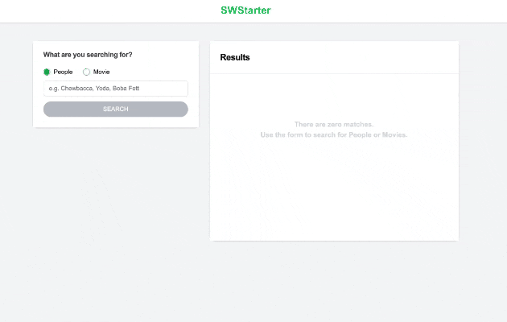
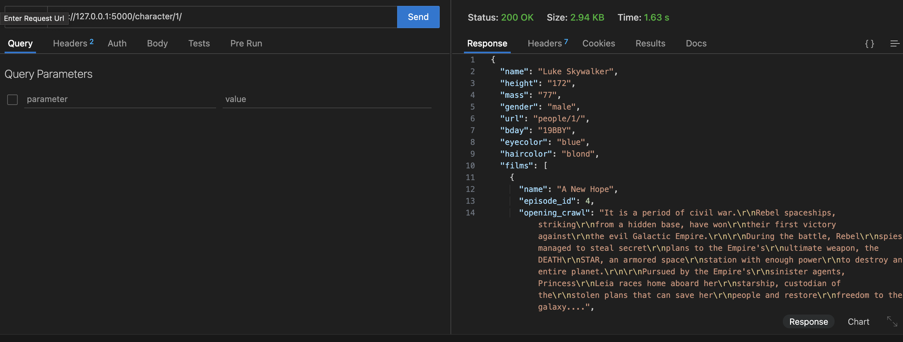
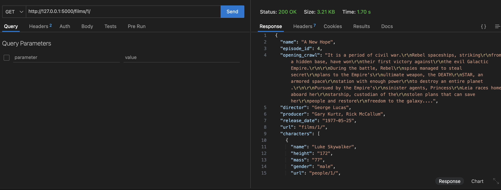
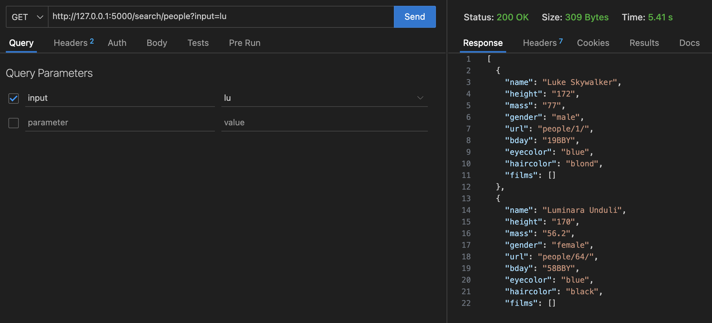
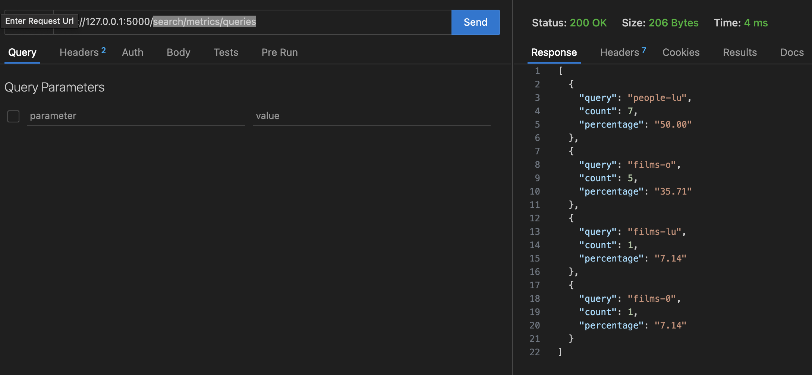

# Lead Software Developer - LawnStarter - Gilberto Santos Application

Welcome to my submission for the LawnStarted selection process! This repository contains a fullstack application designed to showcase my skills in building scalable, maintainable, and user-friendly applications.



## Project Structure

- **Frontend:**  
  Located in the `frontend` folder, this React.js application provides a seamless user interface for interacting with the backend API.

- **Backend:**  
  Found in the `backend` folder, this Node.js Express app serves as the core of the application, managing data and serving API endpoints.

- **Docker Integration:**  
  Both the frontend and backend are unified and containerized using Docker Compose for easy deployment and consistent development environments.

## API Endpoints

The backend exposes the following endpoints:

1. **GET `/character/:id`**  
    Retrieve detailed information about a specific character by their ID.
   

2. **GET `/films/:id`**  
   Get information about a specific film by its ID.
   

3. **GET `/search/:type`**  
   Perform a search by type (e.g., characters, films) to quickly find relevant data.
   

4. **GET `/search/metrics/queries`**  
   Retrieve metrics for search queries to optimize user experience and search performance.
   

## How to Run

Ensure you have Docker and Docker Compose installed on your system.

1. Clone the repository:
   ```bash
   git clone https://github.com/gilbertopsantosjr/fullstack-app-docker
   cd fullstack-app-docker
   ```

Run `docker compose build` then `docker compose up -d` to build and start the containers for both the frontend and backend.
The frontend will be available at http://localhost:3000, and the backend API will be accessible at http://localhost:5000.

## Final Note

Thank you for considering me for this opportunity! I’ve truly enjoyed working through this selection process and look forward to what’s ahead. Please feel free to explore the application and reach out with any feedback or questions.

## Gilberto Santos
